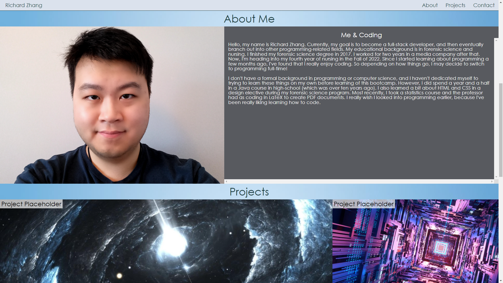

# Richard Zhang Portfolio
> By Richard Zhang

## Description

- My motivation behind this project was to utilize the various things I've learned about HTML and CSS to build a website that will eventually showcase all of the projects that I will build in the future.
- I built this project to gain a better understanding of how to create websites using HTML and CSS. I also wanted to learn more about responsive design elements, and how to code aspects of websites such as contact forms.
- This website is a place where I can link to the various projects that I will develop in the future. As my skills and knowledge grow, I can adapt the website and improve on this admittedly amateur design.
- I learned quite a lot through the creation process of this portfolio webpage. I learned how to utilize the various things we had been taught in class. I also did extensive research into how to code the various pieces of my website. In so doing, I learned more about the various elements, tags, properties and rules to make my website look and respond the way I envisioned. There were also a lot of things I wanted my website to do, but couldn't completely figure out. In these cases, I had to decide how to do things a different way or scrap the idea altogether. Some of these things were completely beyond me, and I didn't understand what the sources were explaining how to incorporate what I wanted. Other times, the solution was to use JavaScript, which we haven't learned yet. Throughout this process, I hit a lot of snags and had to troubleshoot. I even scrapped my initial webpage and started from scratch, because there was just too many problems in my first design. Even though I had these issues, I think I learned a lot.
- My project is not that impressive truth be told. You can tell it's the work of an amateur. But I tried my best, everything that needs to be there is there and I think it's not too bad for a beginner. 

##  Link and Screenshots

> [Link to the live webpage](https://richardzhang01.github.io/richard-zhang-portfolio/)

